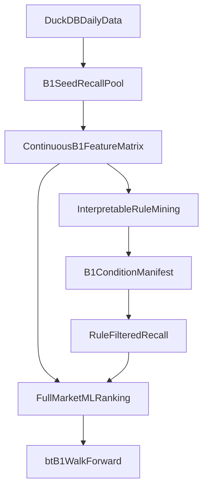

# B1 ML 两阶段计划

## 已确认的研究结论

- 当前主链已经不是原始公式直译，而是逐步手工增强后的硬条件合取：`[utils/b1_factors_opt.py](utils/b1_factors_opt.py)` 里的最终信号本质上是 `TRIGGER/J/LQ/MVOK/GOOD28/MAX28/YANGYIN/视觉量化/周月MACD` 的组合。
- 原始粗粒度基因更接近 `[strategies/tdx_scripts/B1代码v2.04b.txt](strategies/tdx_scripts/B1代码v2.04b.txt)` 的 `J_OK + WL>YL + C>YL + 触发器/量价健康度`，而 `[strategies/tdx_scripts/B1代码3.0.0b.txt](strategies/tdx_scripts/B1代码3.0.0b.txt)` 才开始把“视觉量化”和“均线基因”硬编码进去。
- 历史实验已经给出方向性结论：`[experiments/b1-ml-fullmarket.md](experiments/b1-ml-fullmarket.md)` 有效，但 `[experiments/b1-ml-dedicated.md](experiments/b1-ml-dedicated.md)` 因 B1 子集日均仅约 10~17 只、截面过窄而失效。所以“直接在最终 B1 子集里让模型反推最佳条件”不应作为主线。

## 目标定义

- 第一阶段要产出的是“可解释条件候选库”，形式类似 `J<=x`、`缩量<=y`、`WL-YL 开口>=z`、`周/月 MACD 处于某区间`，用于回答“哪些手工条件真的有增量”。
- 第二阶段要产出的是“排序器”，默认沿用并增强 `[notebooks/b1_ml_explore.py](notebooks/b1_ml_explore.py)` 这条全市场 ML 精排路线，而不是回到 B1 专属窄截面模型。

## 执行方案

### 1. 先定义“B1 召回池”，不要直接从最终 `b1_signal` 开始

- 新增一个研究入口 notebook，例如 `[notebooks/b1_condition_mining.py](notebooks/b1_condition_mining.py)`。
- 召回池只保留最粗的 B1 入场基因，建议第一版以以下层级组织：
  - `seed_core`: `J` 低位、`WL > YL`、`close > YL`。
  - `seed_trigger`: 可选叠加 `TRIGGER` 或 `KEY_K/PLRY` 骨架。
  - `seed_regime`: 仅在你认可的多头/活跃期上评估，`活跃市值` 继续维持人工区间标注，不强行自动化。
- 这样做的目的，是让模型看到“哪些条件能把粗召回进一步变成高质量 B1”，而不是只在已经被你硬筛过的最终样本里做微调。

### 2. 把所有手工经验先改写成连续特征，而不是布尔开关

- 复用并扩展 `[utils/b1_factors_opt.py](utils/b1_factors_opt.py)`、`[notebooks/perfect_top10b1_analyze.py](notebooks/perfect_top10b1_analyze.py)`、`[notebooks/smart_b1_opt.py](notebooks/smart_b1_opt.py)` 里已经出现过的量化表达。
- 第一批特征按四类整理：
  - 趋势共振：`Bias_C_WL`、`Bias_C_YL`、`Bias_WL_YL`、`rw_dif/rw_hist/rm_dif/rm_hist`、`WEEKLY_TREND_OK` 对应的连续前身。
  - 量价质量：`红绿比`、`缩量比`、`max_yang_vol_28` 相关比值、`bad_k_count`、`violent_count`。
  - 形态结构：实体大小、上下影线、回调深度、是否盘中破黄线再站回。
  - 触发上下文：`PLRY_CNT`、`KEY_K_EXIST`、距最近关键 K 的天数、上一波涨幅/换手。
- 输出不要先决定阈值，而是先保留连续值，后面再做分箱和规则提取。

### 3. 用“可解释挖掘”而不是黑盒 end-to-end 找条件

- 在 `[notebooks/b1_condition_mining.py](notebooks/b1_condition_mining.py)` 中先做单变量和双变量稳定性分析：
  - 分箱胜率 / 平均 `MFE` / 平均回撤。
  - bull regime 与非 bull regime 分开看，避免阈值被市场状态污染。
  - walk-forward 检查阈值是否稳定，而不是只看全样本最优点。
- 再用浅层树/规则提取方法（例如 depth 很浅的 GBDT 或单棵小树）把连续特征转成少量规则候选；重点不是追求最高分，而是找“覆盖率 + 稳定性 + 可解释性”都过关的条件。
- 第一版输出应是条件候选清单，例如：

```python
candidate_rule = {
    "j_max": 14.2,
    "vol_shrink_40_max": 0.32,
    "bias_c_yl_min": -0.02,
    "rw_hist_min": 0.0,
}
```

### 4. 把挖出来的条件做成 manifest，不要直接写死进主链

- 新增类似 `[manifests/rotation_feature_sets.py](manifests/rotation_feature_sets.py)` 的 B1 条件注册表，例如 `[manifests/b1_condition_sets.py](manifests/b1_condition_sets.py)`。
- 每个条件集记录：`name`、`status`、`seed_scope`、`rule_expr/params`、`coverage`、`hit_rate`、`mfe`、`回测摘要`、`备注`。
- 这样可以把“实验条件”“候选条件”“主线条件”分开，避免你以后再次陷入 notebook 手工漂移。

### 5. 第二阶段继续走“规则召回 + 全市场 ML 精排”

- 默认复用 `[notebooks/b1_ml_explore.py](notebooks/b1_ml_explore.py)` 的全市场模型，不再把主线押在 `[notebooks/b1_ml_dedicated.py](notebooks/b1_ml_dedicated.py)` 上。
- 条件挖掘阶段得到的结果，有两种接法：
  - 作为新的召回过滤条件，减少低质量候选。
  - 作为连续特征或 `condition_score` 注入全市场 ML，帮助模型理解“更像完美 B1 的程度”。
- 对比基线至少包含三条：
  - 现有 `calc_b1_factors_wmacd + rw_dif_pct`
  - 规则召回 + 现有全市场 ML
  - 新条件召回/增强后 + 全市场 ML

### 6. 验证标准先定死，避免研究跑偏

- 因为你暂时不锁死标签，建议第一版采用“双层验证”而不是只押一种标签：
  - 研究层标签：`5~10 日 MFE`、最大回撤、命中率分层分析。
  - 执行层验证：导出到 Rust `bt-b1`，以真实交易语义验证收益、回撤、换手、候选数。
- 只有同时满足下面几条，条件才允许升级进主链：
  - walk-forward 稳定，不只在单阶段最优。
  - 候选数仍可控，不把 B1 变成泛滥召回。
  - 相对 `rw_dif_pct` 或现有全市场 ML 有明确增量。
  - 解释上能回到你熟悉的 B1 语言，而不是纯黑盒分数。

## 关键代码锚点

- 当前主链信号收口点在 `[utils/b1_factors_opt.py](utils/b1_factors_opt.py)`，这里决定哪些连续特征已经存在、哪些仍是硬阈值。
- 周/月 MACD 经验的来源在 `[notebooks/perfect_top10b1_analyze.py](notebooks/perfect_top10b1_analyze.py)`，适合作为第一批 regime / 动能特征来源。
- 你早期“视觉量化”尝试在 `[notebooks/smart_b1_base.py](notebooks/smart_b1_base.py)` 与 `[notebooks/smart_b1_opt.py](notebooks/smart_b1_opt.py)`，可以直接吸收，不必重做。

## 数据流



## 预期产物

- 一个新的条件挖掘 notebook：`[notebooks/b1_condition_mining.py](notebooks/b1_condition_mining.py)`。
- 一个新的条件 manifest：`[manifests/b1_condition_sets.py](manifests/b1_condition_sets.py)`。
- 一份实验结论文档：`[experiments/b1-condition-mining.md](experiments/b1-condition-mining.md)`。
- 仅当验证通过后，才回写 `[utils/b1_factors_opt.py](utils/b1_factors_opt.py)` 的可选配置项。
